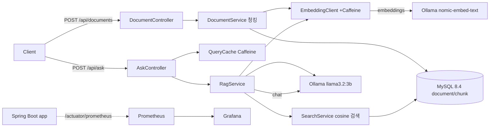

# rag-doc-service

**로컬 LLM(Ollama) 기반 사내 문서 검색·질의(RAG) API.** 모던 Java 21 + Spring Boot 3.3로 만든 확장 가능한 백엔드에서, 실무에서 중요한 4가지 기술 결정(동시성·AI·검색 성능·캐싱/관측성)을 각각 **정량 지표로 검증**한 학습 프로젝트입니다.

> 문서를 올리면 청킹→임베딩→MySQL 저장하고, 질문하면 유사 문서를 근거로 LLM이 답합니다.
> **호스트에 Java 설치가 필요 없습니다** — Docker만 있으면 `docker compose up`으로 전부 실행됩니다.

---

## 이 프로젝트가 보여주는 것

| # | 주제 | 핵심 질문 | 검증 지표 |
|---|---|---|---|
| ① | **Virtual Threads** (Java 21) | I/O 대기가 많은 API에서 플랫폼 스레드풀 대비 처리량이 얼마나 오르나? | 동시 200 질의 처리량 · p99 |
| ② | **Spring AI + RAG** | Java로 로컬 LLM 기반 RAG를 어떻게 구성하나? 환각은 어떻게 억제하나? | 근거 인용 · 컨텍스트 밖 질문 거절 |
| ③ | **MySQL 벡터 검색 최적화** | 임베딩 유사도 검색의 O(N) 전수 스캔을 어떻게 줄이나? | 검색 응답시간 (before→after) |
| ④ | **캐싱 + 관측성** | 반복 질의 비용/지연을 어떻게 줄이고, 성능을 어떻게 기록하나? | 응답시간·LLM 호출 절감 · Grafana |

각 주제의 상세 설계·검증은 [`docs/`](docs/) 참고.

---

## 아키텍처



- **동기 흐름**: `ask` → 캐시 확인 → (miss 시) 질문 임베딩 → 유사 청크 검색 → 프롬프트 조립 → LLM 답변 → 캐시 저장
- **관측**: 앱이 Micrometer로 지표 노출 → Prometheus 수집 → Grafana 대시보드

---

## 기술 스택

- **Java 21** (Record · sealed interface + switch 패턴 매칭 · Virtual Threads), **Spring Boot 3.3.5**
- **Spring AI 1.0.9** (Ollama 임베딩·챗)
- **MySQL 8.4** (Flyway 마이그레이션), 임베딩은 `JSON` 컬럼 저장 + 애플리케이션 코사인 검색
- **Ollama** (로컬·무료 LLM): 임베딩 `nomic-embed-text`, 챗 `llama3.2:3b`
- **관측성**: Micrometer · Prometheus · Grafana / **부하**: k6
- **실행**: Docker Compose (앱 컴파일도 컨테이너의 Java 21이 담당 → 호스트 JDK 불필요)

---

## 빠른 실행 (면접관용 — 필요한 것: Docker만)

```bash
git clone https://github.com/ppupy1209/rac-doc.git
cd rac-doc

# 1) 전체 스택 기동 (앱은 컨테이너 안 Java 21로 빌드됨)
docker compose up --build -d

# 2) 로컬 LLM 모델 최초 1회 pull (약 2GB, 몇 분 소요)
docker compose exec ollama ollama pull nomic-embed-text
docker compose exec ollama ollama pull llama3.2:3b

# 3) 헬스 체크
curl http://localhost:8080/actuator/health      # {"status":"UP"}
```

| 서비스 | URL |
|---|---|
| API | http://localhost:8080 |
| Grafana | http://localhost:3000 (익명 Admin) |
| Prometheus | http://localhost:9090 |

종료: `docker compose down` (데이터까지 초기화: `docker compose down -v`)

> **포트 충돌 시**: 로컬에 이미 MySQL(3306)·Grafana(3000) 등이 떠 있으면 `.env.example`을 `.env`로 복사해 호스트 포트만 바꾸세요(컨테이너 내부는 그대로). 예: `MYSQL_PORT=13306`, `GRAFANA_PORT=3001`.

### API 사용 예시

```bash
# 문서 업로드
curl -X POST http://localhost:8080/api/documents \
  -H "Content-Type: application/json" \
  -d '{"title":"휴가 규정","content":"연차 휴가는 입사 1년 후 15일이 부여된다. ..."}'

# 질문
curl -X POST http://localhost:8080/api/ask \
  -H "Content-Type: application/json" \
  -d '{"question":"연차는 며칠 나오나요?","topK":4}'
# -> { "answer": "...15일...", "sources": [...], "latencyMs": 000, "cached": false }
```

---

## study 상세

> 측정값은 로컬 하드웨어(특히 Ollama 성능)에 좌우되므로 **실측치**를 기입합니다. 방향성과 해석이 핵심입니다.

### ① Virtual Threads로 I/O 바운드 처리량 개선
I/O 대기가 많은 요청에서 플랫폼 스레드풀 대비 처리량이 얼마나 오르는지 측정했다.
실제 `/api/ask`는 Ollama(LLM)가 병목이라 스레드 효과가 가려지므로, **"느린 외부 I/O 대기(200ms)"만 순수 재현하는 통제 엔드포인트** `/api/bench/io`로 변수를 격리했다. `spring.threads.virtual.enabled` 토글로 A/B 비교.

```bash
# 부하 비교 (k6 — 설치 불필요, Docker로 실행)
docker compose up -d --force-recreate app                                 # 가상 스레드 OFF (기본)
docker run --rm -i --network rag-doc-service_default -e BASE=http://app:8080 grafana/k6 run - < bench/io-load.js

VTHREADS=true docker compose up -d --force-recreate app                   # 가상 스레드 ON
docker run --rm -i --network rag-doc-service_default -e BASE=http://app:8080 grafana/k6 run - < bench/io-load.js
```

**측정 결과** (로컬, 500 동시 사용자 · 20초, 엔드포인트 대기 200ms):

| 지표 | 플랫폼 스레드 (OFF) | 가상 스레드 (ON) |
|---|---|---|
| 처리량 | 989 req/s | **2,416 req/s** (약 2.4배) |
| p99 응답 | 604 ms | **209 ms** |
| 평균 응답 | 498 ms | 201 ms |

**해석:** 플랫폼 스레드는 기본 200개라 500명이 동시에 오면 300명이 큐에서 대기 → 처리량이 막히고 응답이 부풀었다. 가상 스레드는 대기 중 캐리어를 반납해 수백 개를 동시에 처리 → 처리량 2.4배, 응답시간은 순수 작업시간(200ms)에 근접. 상세 [`docs/LEARNING-virtual-threads.md`](docs/LEARNING-virtual-threads.md)

### ② Spring AI + RAG 파이프라인
질문 임베딩 → 유사 청크 검색 → "컨텍스트만 근거로 답하라" 프롬프트 조립 → LLM. 문서에 없는 질문은 "모른다"고 답하도록 설계(환각 억제). 상세 [`docs/LEARNING-rag.md`](docs/LEARNING-rag.md)

### ③ MySQL 벡터 검색 최적화
현재 baseline은 전체 청크 임베딩을 읽어 애플리케이션에서 코사인 유사도를 계산하는 **O(N) 전수 스캔**([`SearchService`](src/main/java/com/yeonwoo/ragdoc/search/SearchService.java)의 `study #3` 지점). 후보 축소·정규화 인메모리 인덱스 등으로 최적화하고 응답시간을 비교한다.
- 결과: N=___ 청크에서 검색 응답 `___ → ___ ms` *(측정 후 기입)*

### ④ 캐싱 + 관측성
동일/유사 질의를 Caffeine 캐시([`QueryCache`](src/main/java/com/yeonwoo/ragdoc/cache/QueryCache.java))로 단락시켜 LLM 재호출을 없앤다. 성능은 Prometheus/Grafana로 기록.
- 결과: 캐시 히트 시 응답 `___ → ___ ms`, LLM 호출 `___% 감소` *(측정 후 기입)*

---

## 프로젝트 구조

```
src/main/java/com/yeonwoo/ragdoc/
├─ common/     record DTO, sealed RagResult, 예외 핸들러
├─ document/   문서 CRUD·청킹·JPA 엔티티
├─ embedding/  Ollama 임베딩 클라이언트(+Caffeine 캐시)
├─ search/     코사인 유사도 검색 (study ③)
├─ rag/        검색→프롬프트→LLM 오케스트레이션 (study ②)
├─ ask/        POST /api/ask — 동시성 핫스팟 (study ①)
└─ cache/      질의 캐시 (study ④)
docs/          설계 문서(DESIGN)·학습 노트(LEARNING)
bench/         k6 부하 스크립트
```

---

## 왜 이렇게 만들었나 (설계 노트)

- **RagResult를 sealed interface로** — 답변/컨텍스트 없음/LLM 오류를 타입으로 강제하고, 컨트롤러에서 `switch` 패턴 매칭으로 누락 없이 처리
- **임베딩을 별도 벡터 DB 없이 MySQL JSON에** — study ③에서 "전수 스캔의 한계와 최적화"를 직접 다루기 위한 의도적 선택
- **로컬 Ollama** — API 키·비용 없이 누구나 클론 후 바로 실행 가능

자세한 계약(API·스키마·버전)은 [`docs/DESIGN.md`](docs/DESIGN.md).
